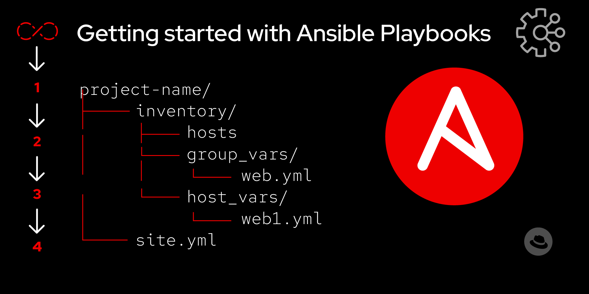

# Estudio del módulo Ansible: `package`





## Introducción a Ansible
Ansible es una herramienta de automatización de configuración y gestión de sistemas que permite administrar servidores de manera eficiente y sin agentes. Funciona utilizando SSH para conectarse a los nodos y ejecutar tareas definidas en playbooks escritos en YAML. Su sintaxis simple y su capacidad de trabajar en múltiples sistemas operativos lo hacen una opción ideal para la automatización de tareas repetitivas en entornos de TI.

## **1. Nombre del módulo**

### Módulo: `ansible.builtin.package`

El módulo `package` se utiliza para administrar paquetes en sistemas Linux de manera agnóstica al gestor de paquetes. Es compatible con `apt`, `yum`, `dnf`, `zypper` y otros, lo que lo hace útil para entornos heterogéneos.

 **Parámetros**

| Parámetro   | Descripción |
|------------|-------------|
| `name` | Nombre del paquete o lista de paquetes a instalar, actualizar o eliminar. |
| `state` | Estado deseado del paquete: `present`, `latest` o `absent`. |
| `use` | Especifica el gestor de paquetes a utilizar (`apt`, `yum`, `dnf`, etc.). |

 **Estados admitidos**

 **`present`**: Asegura que el paquete esté instalado.
- **`latest`**: Instala o actualiza el paquete a la última versión disponible.
- **`absent`**: Elimina el paquete del sistema.

## **2. Ejemplos de funcionamiento**
# Estudio del módulo Ansible: `package`

## **Pasos previos: Ejecución del script `scriptmaquinas.sh`**

Antes de ejecutar cualquier playbook en las máquinas de destino, es necesario ejecutar un script de configuración previo que esta  en la carpeta del proyecto. Este script, `scriptmaquinas.sh`, debe ejecutarse en todas las máquinas servidores donde se vayan a ejecutar las acciones de los playbooks. Esto asegura que los servidores estén preparados para recibir las configuraciones que definan los playbooks.

[Script](scriptmaquinas.sh)

```bash
# Ejecutar el script en cada servidor:
./scriptmaquinas.sh
```

### Ejemplo 1: Instalación de un paquete

Este playbook instala el paquete `htop` en cualquier distribución de Linux sin necesidad de especificar el gestor de paquetes.

[InstalatHtop](playbooks/InstalatHtop.yml)

**Captura del playbook:**  


**Captura del resultado:**  


---

### Ejemplo 2: Actualización de un paquete

Este playbook actualiza el paquete `nano` en cualquier sistema Linux.

[ActualizarNano](playbooks/Actualizarnano.yml)

**Captura del playbook:**  


---

### Ejemplo 3: Eliminación de un paquete

Este playbook elimina el paquete `apache2` o `httpd`, dependiendo de la distribución.

[EliminarApache](playbooks/EliminarApache.yml)

**Captura del playbook:**  


## **3. Referencias**

- Documentación oficial de Ansible: [https://docs.ansible.com/ansible/latest/collections/ansible/builtin/package_module.html](https://docs.ansible.com/ansible/latest/collections/ansible/builtin/package_module.html)

- [Manuel Domínguez ](https://github.com/mftienda)

